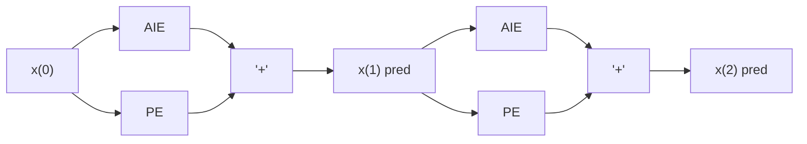
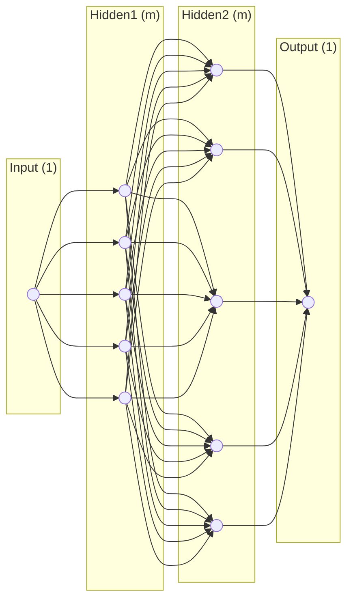

# #date/2025/01/06
2 big applications:
	new tech/physics
	make current science more efficient (recognizing hurricanes and cyclones)

Challenges:
	lack of real world observation
		bad/corrupt data sets (toxic internet, satire)
	sparse!
		limited number of measurements you can take
	spacial-temporal
		no tools to handle space and time at the same time
		multi-scale :
			multi-scale with no scale seperation (scales are tightly coupled)
		chaos:
			sensitive to initial conditions
				maybe behave like it's random but is not
			applies to the "model of a system" (e.g. weatther on earth is a chaotic system, but is still deterministic everyday (our way of modeling the system is therefore chaotic))

general form of a partial differential 
$$\frac{\partial{}\vec{u}}{\partial{}t} = F(\vec{u}; p)$$
$\vec{u}$ is a state vector
F is a complicated nonlinear function
p is the parameter distribution of u


biggest drive of Scientific Machine learning is to speed up current methods of numerical analysis while making it more accurate. 

autoregressive emulation:
	means you are trying to solve a system like $\frac{du}{dt}=F(u)$ but you dont know what one of the peices looks like 
	what to do?
		make a set of observations as a time series (u(t0), u(t1), ..., u(tn))
		now you have a continuous model ($\Delta x\rightarrow{0}$) but discrete observations
		so we need an ML model
		all ML models today:
			$\tilde{u}(t_{i+1}) \approx M(\theta, \tilde{u}(t_{i}))$
			$\tilde{u}(t_{i+1})$ = future state vector
			M is the model
			$\theta$ = parameters
			$\tilde{u}(t_{i})$ = current state vector
		then we can plug in our prediction and then get prediction at the next step	
		now we have errors
		empirical risk (loss function)
			L($\theta$) = $E_{i}[{\{\tilde{u}(t_{i+1})-M(\theta, \tilde{u}(t_{i}))}^2]$
			$\theta^*$ = argmin L($\theta$)
				argmin is an optimization function

# #date/2025/01/08
AR emulation:
	$\frac{d\bar{u}}{dt}=F(u)$
	where F is either unknown or partially known 
1st order Markov model doesnt require memory to make a prediction:
	$\tilde{u}(t_{i+1})=M(\theta;\tilde{u}_{t_{i}})$
empirical risk (loss function)
	L($\theta$) = $E_{i}[{\{\tilde{u}(t_{i+1})-M(\theta, \tilde{u}(t_{i}))}^2]$
	$\theta^*$ = argmin L($\theta$)
then we can use the new parameters $\theta^*$ to start predictions (we have a trianed model)
The most imporant thing (if you're a physicist?) is that it converges ($\nabla \cdot\bar{u}=0$)
no matter what linear physics you can always design a model M so that it is hard constrained by the divergence 

discovering new physics (parameter estimation):
	in physics getting a prediction without knowing the model is not enough
		fix this by using sindy (sparse identification dynamical sys)
			modern algorithm is (RVM $\rightarrow$ sindy)
		 $F=c_{1}(f_{1})+c_{2}(f_{3})+c_{3}(f_{3})+\dots+c_{k}(f_{k})$
			 #important: F is linear in $c_{i}$ but not in $\tilde{u}$
		 $L(c)=\sum^n_{i=0}||\frac{\partial\bar{u}}{\partial t}-\sum^u_{j=1}c_{k}f_{k}||$
			we can then use techniques to find small f that dont (significantly?) affect the final F
			then we function defined by only a few basis functions can be analysed easier (not so much of black box)
		$C^*_{k}=$ argmin L(c)

****
$\frac{d\bar{u}}{dt}=F(\bar{u})$
$\bar{x}=[\vec{u}(t_{0}), \vec{u}(t_{1}), \vec{u}(t_{2}), \dots, \vec{u}(t_{k})]$
	in the 1d heat equation this means at any point in time along each point of x there is a temperature value being recorded into the matrix

data-matrix $\bar{x}$ is long or short and fat because you need to trade off either temporal or spacial elements and the temporal reolution must be very very high so there cant be very temporal steps

in multiple dimensions either make tensors or reshape your spacial grid into a vectorized format

#coding-advice:
	matrix traversal in C should be row and then column vs column row in fortran because that is the way that memory is stored and once the first element of either the row or column is accessed from memory, the entire vector is saved to cache which has faster retrieval


Singular Value Decomposition (SVD)
dimensional reduction:
$n>m$
$\bar{x}_{n\times m}=\hat{U}_{n\times n}\sum_{n\times m}\hat{V}^*_{m\times m}$
	where 
		U = left singular vectors
			$U^{-1}=U^*$
			$UU^*=I$
		$\sum$=singular value
		$V^*$ = right singular vectors
			$V^{-1}=V^*$
			$VV^*=I$
Economy SVD
	from U we only need to retain an $n\times m$ section
	from $\sum$ we only need to retain a diagonal matrix size $m\times m$ containing only positive singular values
	from $V^*$ we retain the entire $m\times m$ section

# #date/2025/01/10
SVD review:
	$\bar{x}=(\bar{x}_{0}, \bar{x}_{1},\dots,\bar{x}_{m})$
	where 
	$\bar{x}$ is an $n\times m$ matrix
	we can use Singular value decomposition to represent 
	$\bar{x}=U\sum V^*$
	where
	U is an $n\times n$ left singular vector
	$\sum$ is an $n\times m$ singular vector values matrix
	$V^*$ is an $m\times m$ right singular vector

$n>m$
Economy SVD
	from U we only need to retain an $n\times m$ section
	from $\sum$ we only need to retain a diagonal matrix size $m\times m$ containing only positive singular values
	from $V^*$ we retain the entire $m\times m$ section

lecture 2 notes:
![[Pasted image 20250110134842.png]]
then we can write 
the dyadic-sum
$\bar{x}=\sum^m_{k=1}[u_{k}\sigma_{k}v^*_{k}]$
where for any value of k:
	$u_{k}$ is a column vector $n\times1$
	$\sigma_{k}$ is a scalar quantity $1\times1$
	$v^*_{k}$ is a row vector $1\times m$
then we can estimate $\tilde{x}$ using the first r columns
$\tilde{x}=\sum^r_{k=1}[u_{k}\sigma_{k}v^*_{k}]$
this way we can reduce the rank of $\bar{x}$ by varying r
lecture 2 notes:
![[Pasted image 20250110135608.png]]
we can measure accuracy by taking
$||x-\tilde{x}||_{F}=\sum^m_{k=r+1}\sigma^2_{k}$
where $\sigma$ are the values that you neglect and are the diagonal of the singular matrix $\sum$ where $\sigma_{1}\geq\sigma_{2}\geq\dots\geq \sigma_{m}$
all $\sigma_{k}\geq0$ 
ex if you want to reach a certain amount of error then you can estimate how many ranks you will need, this is valuable because you can compute your solution to your desired error with much compute than computing the solution and then making sure its within your error

lecture 2 notes:

$\hat{\sum}^2$ are the eigen values of $xx*$ the covariance matrix and also the square of the singular values of x
this way we can compute U and the eigen vectors

we can also do $x^*x$ to get V and the eigen vectors

lecture 3:
# #date/2025/01/13
review:
	SVD Natural Image
	if you maintain $||x-\tilde{x}||_{F}=\sum^m_{k=r+1}\sigma^2_{k}$
	where $\tilde{x}$ is of rank r, then $\sum^m_{k=r+1}\sigma^2_{k}$ 
	even with just 10 ranks from the original 1200 we can quickly approximate a dog:
	![[Pasted image 20250113133002.png]]
	![[Pasted image 20250113133009.png]]


Lecture 4:
	Theory-of-linear-models:
		Training data:
			$(x_{1}, y_{1}), (x_{2}, y_{2}),\dots,(x_{n}, y_{n})$
			every one of these is a sample
		Test data
			$(x_{n}, y_{n}),(x_{n+2}, y_{n+2}),\dots$
		training data should be compeletely seperate from test data.
		if there is an overlap it is called data-leakage 
	the most basic linear model:
		input: $\alpha_{1}, \alpha_{2}$
		then the model is:
			$y_{1}=\alpha_{1}x_{1}+\alpha_{1}$
			$y_{2}=\alpha_{2}x_{2}+\alpha_{2}$
			.
			.
			.
			$y_{n}=\alpha_{n}x_{n}+\alpha_{n}$
		put this into a matrix 
		
![[Recording 20250113143624.m4a]]	
> [!summary]- Click to Expand
>![[scribe-2025-01-13-Understanding SVD and Fluid Dynamics in Data Analysis#AI Summary]]

# #date/2025/01/15 
Theory-of-linear-models:
		Training data:
			$(x_{1}, y_{1}), (x_{2}, y_{2}),\dots,(x_{n}, y_{n})$
			every one of these is a sample
		Test data
			$(x_{n}, y_{n}),(x_{n+2}, y_{n+2}),\dots$
		training data should be compeletely seperate from test data.
		if there is an overlap it is called data-leakage 
	the most basic linear model:
		input: $\alpha_{1}, \alpha_{2}$
		then the model is:
			$y_{1}=\alpha_{1}x_{1}+\alpha_{2}x_{1}^2+\alpha_{3}$
			$y_{2}=\alpha_{1}x_{2}+\alpha_{2}x_{2}^2+\alpha_{3}$
			.
			.
			.
			$y_{n}=\alpha_{1}x_{n}+\alpha_{2}$
		put this into a matrix 
							$f_{1}\quad\qquad f_{2}\quad\qquad f_{3}\quad\dots f_{p}$
$$\begin{bmatrix}y_{1}\\y_{2}\\\dots\\yn\end{bmatrix}=\begin{bmatrix}\dots&&x_{1}&&x_{1}^2&&x_{1}^3&&x_{1}^p\\\dots&&x_{2}&&x_{2}^2&&x_{2}^3&&x_{2}^p\\\dots&&\dots&&\dots&&\dots&&\dots\\ \dots&&xn&&xn^2&&xn^3&&xn^p\end{bmatrix}\begin{bmatrix}
\alpha_{p}\\ \alpha_{3}\\ \alpha_{2}\\ \alpha_{1}
\end{bmatrix}$$
				nx1                               nxp                                    px1
		for n >> p
		$y_{n\times 1}=A_{n\times p}\theta_{p\times 1}\rightarrow \theta^*=A^+y=(A^TA)^{-1}A^Ty$
			$A^+=(A^TA)^{-1}A^T$
				pseudo inverse
			zero solutions?
		p>>n
		$y_{n\times 1}=A_{n\times p}\theta_{p\times 1}\rightarrow \theta^*=A^+y$
		$||\theta^*||_{2}$
	#TLDR: both the solutions are given by the pseodo inverse, one gives you the optimal solution and one gives you the L2 norm??
	bias-variance:
	![[AM160 Notes-1736978556212.jpeg]]
	$y=f(x)$
	$\hat{y}=\hat{f_{d}}(x)$
	$E_{n}[\hat{f_{D_{N}}}(x)]-f(x)$
### Double Descent
model with p>>n  (eg training data has 20 points, and we are testing on 12)
	![[AM160 Notes-1736979187259.jpeg]]
model with n>>p (training is 20 pts, testing is 40)
	![[AM160 Notes-1736979300484.jpeg]]
model with n>>p (training is 20, testing is 100)
	![[AM160 Notes-1736979370412.jpeg]]
Every modern model has 3 orders of magnitude more parameter than samples
even on infite (eg p is a bigger order of infinity than n)

![[Recording 20250115142500.m4a]]

> [!summary]- Click to Expand
> ![[scribe-2025-01-15-Exploring Linear Models, Pseudo-Inverse, and Double Descent Phenomenon#Summary]]

# #date/2025/01/17 
Double descent:
	![[AM160 Notes-1737149684248.jpeg]]
the more that you keep increasing P the higher the likelyhood that they cannot remain orthogonal and therefore cant be linear independance

in a linear model double descent is caused by linear dependance 

$p>n$
$\sum=(AA^T)$ (wishard matrix)
$p\to \infty \text{ what is } p_{\lambda}(\sum)=0$

Pseudo Inverse
$y=A\theta$
$A^Ty=(A^TA)\theta$
$\theta^*={\underbrace{(A^TA)^{-1}}_{\underbrace{\text{gram matrix pxp}}_{\text{full rank}}}}A^Ty,\ n\gg p$

Issues with figuring out double descent:
	there are so many dials you can tweak to regularize the model, but the only way to see the double descent is without any regularization
	people were missing the phase transition
#important:
	**there is no such thing as overfitting**, if you have regularizers off you have to push your parameters to the point of double descent, or if you have regularizers you keep pushing your parameters and you just wont see the double descent
in real models we get double descent when: 
$$
\begin{equation*}
\begin{aligned}
n &\to \infty,\\
p &\to \infty,\ \text{(dimension of your model)},\\
\frac{n}{p} &= \text{constant << 1},\\
x &\in R^1 \\
y &\in R^1
\end{aligned}
\end{equation*}
$$
$$
\begin{matrix}
| && \cos(w_{11}x_{1}) && \cos(w_{21}x_{1}) && \dots && \cos(w_{p1}x_{1})\\
| && \cos(w_{12}x_{2}) && \cos(w_{22}x_{2}) && \dots && \cos(w_{p{2}}x_{2}) \\
\end{matrix}
$$

$y=A_{n\times p}\theta$
$\theta^*=(A^TA)^{-1}A^Ty$
$\underbrace{y=A(\hat{\theta}+\eta)}_{\text{training data}}$
then 
$||\hat{\theta}-\theta^*||^2_{2}\approx||\hat{y}-y^*||^2_{2}$
$||\hat{\theta}-(A^TA)^{-1}A^Ty||^2_{2}$
$=||\hat{\theta}-(A^TA)^{-1}A^T(A(\hat{\theta}+\eta))||^2_{2}$
$=||(A^TA)^{-1}A^T\eta||^2_{2}$

$E_{N}||\hat{\theta}-\theta^*||$
$=E_{N}(\eta A(A^TA)^{-2}A^T\eta^T)\implies \sigma ^2T_{r}( A(A^TA)^{-2}A^T)$
	$E_{x}[x^T\beta x]=T_{\mathcal{r}}(\beta)$

$\hat{\sum}\text{ is a wishart matrix of }\hat{\sum}=\frac{1}{n}x^Tx$


![[Recording 20250117142846.m4a]]
> [!summary]- Click to Expand
> ![[scribe-2025-01-17-Understanding Double Descent in Deep Learning Models#Summary]]

# #date/2025/01/22
## recap:
the double descent curve can be exactly defined
$\gamma=\left( \frac{p}{n} \right)$
if $\gamma>1$ then double descent can occur
if $\gamma <1$ then theres no double descent yet
$A\theta=y\quad n\gg p$
$\theta^*=\underbrace{(A^TA)^{-1}}_{{p\times p}}A^Ty$
$y_{n}=A\hat{\theta}+\eta$ where $\eta$ is noise
$||\theta^*-\hat{\theta}||_{2}^2$ subscript means its 2 norm, and the superscript is part of the error
$||()||^2=()()^T$ can get rid of the 2 norm with this 
$=(\eta(A(A^TA)^{-2}A^T)\eta^T)$
$\eta$ = gaussian sample, you get it by doing torch.randn(1)
the error that you track $||\theta^*-\hat{\theta}||_{2}^2$ is the average of each gaussian sample
$E_{n}||\theta^*-\hat{\theta}||_{2}^2=E_{n}(\eta(A(A^TA)^{-2}A^T)\eta^T)$
	$E_{n}=$ expectation n
	$E_{x}(x\beta x^T)=\sigma^2T\gamma(\beta)$
$=\alpha^2T\gamma((A^TA)^{-1})=\sigma^2\gamma\left( tr\left( \frac{A^TA}{N} \right)^{-1} \right)$
	$\frac{A^TA}{n}=\sum^{n}(\text{wishard matrix})$
	$\\as\ n\to \infty\quad p(t)=\frac{1}{2A\gamma t}\sqrt{(r_{t}-t)(t-r)}$
$=\sigma^2\gamma\left( tr\left( \frac{A^TA}{N} \right)^{-1} \right)=\frac{\sigma^2\gamma}{\gamma-1}$
now we have
	$\gamma<1: \frac{\sigma^2\gamma}{\gamma-1}$
	$\gamma>1:\underbrace{||\hat{\theta}||_{2}^2}_{const}\left( 1-\frac{1}{\gamma} \right) +\frac{\sigma^2\gamma}{\gamma-1}$
#important:
	the double descent curve isnt always visible but it is always there
	meaning the more parameters the better your model (no such thing as over fitting)
	if you have a large number of samples make sure your number of parameters are much much bigger
## Lecture 6 SINDY
Sparse Identification of Nonlinear Systems
### Main Idea:
you have a dynamical system $\frac{du}{dt}=F(u)$ (strongly nonlinear and F is unknown)
what you do have: training data from time samples $[\bar{u}(t_{0}), \bar{u}(t_{1}),\dots,\bar{u}(t_{n})]$
**Question**: what is the simplest representation of F(u)
the more parsimony (the simpler model) the easier it is to generalize, in ML we start with a huge amount of parameters for accuracy and the result with be simpler because the model will learn what parameters are important and which aren't

 $[\bar{u}(t_{0}), \bar{u}(t_{1}),\dots,\bar{u}(t_{n})]\underbrace{\to}_{derivatives}[\dot{u}(t_{0}), \dot{u}(t_{1}),\dots,\dot{u}(t_{n})]$ 
	derivate using $\frac{t_{2}-t_{1}}{\Delta t}$
 we can write F as
 $F=c_{1}\theta_{1}(u)+c_{2}\theta_{2}(u)+\dots+c_{k}\theta_{k}(u)$
	 F is non linear in $u$ but is linear in $c$
 $\dot{x}\approx \theta E \implies E=\dot{x}\theta^T$
 where $\dot{x}$ is the matrix of our derivatives ($\dot{x}=[\dot{u}(t_{0}), \dot{u}(t_{1}),\dots,\dot{u}(t_{n})]$) 
 $\theta$ is our theta matrix of our basis functions 
$$
\theta=\left[
\begin{matrix}
\theta_{1}(u(t_{1}))&\theta_{2}(u(t_{1})) & \dots  & \theta_{k}(u(t_{1})) \\
\theta_{1}(u(t_{2}))&\theta_{2}(u(t_{2})) & \dots  & \theta_{k}(u(t_{2})) \\
\vdots  & \vdots & \vdots & \vdots\\
\theta_{1}(u(t_{n}))&\theta_{2}(u(t_{n})) & \dots  & \theta_{k}(u(t_{n})) 
\end{matrix} 
\right]
\overbrace{
\left[
\begin{matrix}
c_{1} \\
c_{2} \\
\vdots \\
c_{k}
\end{matrix}
\right]}^{E}
$$
the dimensions of $\dot{x}^T$ must match the dimension of $E$, $\theta$ always maintains $n\times k$
and you can solve for the columns of E (each feature) by using each row of $\dot{x}$

$L(E)=\lVert \dot{x}-\theta E \rVert_{2}^2+\lambda\lVert E \rVert_{1}$
where $\lVert()\rVert_{2}$ is the square root of the sum of a vector's squares
and $\lVert()\rVert_{1}$ is the sum of a vector's absolute values
if we were to use the 2 norm to regularize ($\lVert E \rVert_{2}$) we discourage parsity (we encourage the elements to be small but never zero) this is what we get when we use pseudo inverse
however by using the 1 norm to regularize ($\lVert E \rVert_{1}$) then we can get parsity
$\lambda \lVert E \rVert_{1}$ - $L_{1}-\text{penalty}$ (LASS)

![[Recording 20250122142508.m4a]]
>[!summary]- Click to Expand
>![[scribe-2025-01-22-Double Descent and Cindy Algorithm in Linear Systems#Summary]]


# #date/2025/01/24
## Recap:
$\frac{du}{dt}=F(u)\implies F=c_{1}\theta_{1}+c_{2}\theta_{2}+\dots+c_{k}\theta_{k}$
$\dot{X}=\theta E$
	$L(E)=\lVert \dot{x}-\theta E \rVert_{2}^2+\lambda\lVert E \rVert_{1}$

Lorenz 63 system
$$
\begin{align}
\frac{dx}{dt}&=\alpha(y-x) \\
\frac{dy}{dt}&=\gamma(\rho-z) \\
\frac{dz}{dt}&=xy-\beta z \\
\end{align}
$$
$$\frac{d}{dt}\left(\begin{matrix}x\\ y\\ z\end{matrix}\right)=F\left(\begin{matrix}x \\ y\\ z\end{matrix}\right)$$
$$
\overbrace{
\left[
\begin{matrix}
\frac{dx}{dt}(t_{1}) & \frac{dy}{dt}(t_{1}) & \frac{dz}{dt}(t_{1}) \\
\frac{dx}{dt}(t_{2}) & \vdots & \vdots\\
\vdots & \vdots & \vdots \\
\vdots & \vdots & \vdots\\
\vdots & \vdots & \vdots \\
\frac{dx}{dt}(t_{n}) & \frac{dy}{dt}(t_{n}) & \frac{dz}{dt}(t_{n})
\end{matrix}
\right]}^{\dot{x}}_{n\times{3}}
=
\left[
\begin{matrix}
1 & x & y & z & x^2 & xy & xz & x^2 & y^2 & yz & z^2 \\ \hline
1 & x(t_{1}) & y(t_{1}) & & x^2(t_{1}) & x(t_{1})y(t_{1}) \\
1 & x(t_{2}) & y(t_{2}) & &  \vdots& x(t_{2})y(t_{2})\\
1 & x(t_{3}) & \vdots & &  \vdots\\\\
1 & \vdots& \vdots & &  \vdots\\\\
1 & x(t_{n}) & yt_{n} &  & x^2(t_{n})
\end{matrix}
\right]_{n\times 10}
\left[
\begin{matrix}
c_{11}  & c_{12} & c_{13}\\
c_{21}  & c_{22} & \vdots\\
\vdots \\
\vdots \\
\vdots \\
c_{101} & c_{102} & c_{103}
\end{matrix}
\right]
$$


![[Recording 20250124142608.m4a]]
>[!summary]- Click to Expand
>![[scribe-2025-01-24-Lorenz System and Derivative Analysis#Summary]]
# #date/2025/01/27 
## From General Linear Models to general non linear models
$$
\begin{align}
x &\in R^p \\
y& \in R^d \\
y_{n}&=g(x_{n}) 
\end{align}
$$$$
\bar{Y}=\left[
\begin{matrix}
y_{1}^1 & y_{1}^2 & \dots & y_{1}^d \\
y_{2}^1 & y_{2}^2 & \dots & y_{2}^d  \\
\vdots \\
y_{n}^1 & y_{n}^2 & \dots & y_{n}^d 
\end{matrix}\right]_{n \times d}
=
\left[\begin{matrix}
\psi_{1}(x_{1}) & \dots & \psi_{k}(x_{1}) \\
\vdots \\ 
\vdots \\
\psi_{1}(x_{n}) & \dots & \psi_{k}(x_{n}) \\
\end{matrix}\right]_{n \times k}
\left[\begin{matrix}
\theta_{11} & \dots & \theta_{1d}) \\
\vdots \\ 
\vdots \\
\theta_{k1} & \dots & \theta_{kd}) \\
\end{matrix}\right]_{k \times d}
$$
there needs to be flexibilty
$g:R^p\to R^d$
	eg if we are taking in images and classifying them as cats and dogs
	we go from an nxd image to a binary output
$$
\left[
\begin{matrix}
y^1 \\
\vdots \\
y^d
\end{matrix}
\right]
=
\left[
\begin{matrix}
\theta^2_{11} & \theta^2_{12} & \dots & \theta^2_{1m} \\
\vdots \\
\theta^2_{d1} & \theta^2_{d2} & \dots & \theta^2_{dm} \\
\end{matrix}
\right]_{d\times m}
\left[
\begin{matrix}
\theta^1_{11} & \theta^1_{12} & \dots & \theta^1_{1p} \\
\vdots \\
\theta^1_{m1} & \theta^1_{m2} & \dots & \theta^1_{mp} \\
\end{matrix}
\right]_{\underbrace{m\times p}_{\text{free hyper-parameters}}}
\left[
\begin{matrix}
x^1 \\
\vdots \\
x^d
\end{matrix}
\right]_{p\times 1}
$$
$\theta^1 \text{ and } \theta^2$ are trainable
$L\left(\begin{array} \\ \theta^1 \\ \theta^2\end{array}\right) = \sum^n_{nj=1}||\bar{Y}_{i}-\theta^2\theta^1x_{i}||_{2}^2=E_{}{i}||\bar{Y}_{i}-\theta^2\theta^1x_{i}||_{2}^2$
$Y=\theta^2\theta^1x \to$ non linear in y
$Y=\theta^2\sigma(\theta^1x)$
	where $\sigma$ is a non linear random feature model
	or non linear transform function

Now we can increase the number of theta matrixes and make each undergo the random feature model
	eg: with 3 $\theta$ matrixes $Y=\theta^3\sigma(\theta^2(\sigma(\theta^1x)))$
output of your loss function is a scalar no matter how complicated your function is, if it is no longer a scalara the math starts to breakdown

## Graphical Structure of a Neural Net (NN)
Perceptron Model (MLP)
![[Drawing 2025-01-21 15.33.08.excalidraw]]
for the first layer $h_{j^1}=\sigma\left( \sum_{j}\theta_{ij}x_{j} \right)$
you can remove the $\sum$ because the notation $(\theta_{ij}x_{j})$ implies the sum, this is called Einstein's notation

in neural nets we add a bias term
$h_{i}^l=\sigma(\theta^l_{ij}h_{j}^{l-1}+b_{i})$
essentially layer L can be computed by using the previous layer

![[Recording 20250127142243.m4a]]
>[!summary]- Click to Expand
>![[scribe-2025-01-27-Understanding Linear Models and Neural Networks#Summary]]

# #date/01-29-2025 
Rectified Linear Unit (ReLu):
$\sigma(\zeta)=max(0, \zeta)=\{\begin{array}\\\zeta,\ \zeta\geq0\\0,\ \zeta<0\end{array}$
```python
import micropip
await micropip.install("numpy")
await micropip.install("matplotlib")
import numpy as np
import matplotlib.pyplot as plt

# Define ReLU function
def relu(x):
    return np.maximum(0, x)

def tanh(x):
	return np.tanh(x)

# Generate input values
x = np.linspace(-10, 10, 400)
y = tanh(x)

# Plot the ReLU function
plt.figure(figsize=(8, 5))
plt.plot(x, y, label="Tanh(x)", color='blue', linewidth=2)
plt.axhline(0, color='black', linewidth=0.8)
plt.axvline(0, color='black', linewidth=0.8)
plt.grid(True, linestyle='--', alpha=0.6)

# Labels and title
plt.xlabel("Input")
plt.ylabel("Output")
plt.title("Tanh Activation Function")
plt.legend()
plt.show()

```
![[Reluplot.png]]
sub differentiable, 2nd derivative is $\delta\ at\ \zeta=0$

Leaky ReLu:
$\sigma(\zeta)=max(0, \zeta)=\{\begin{array}\\\zeta,\ \zeta\geq0\\\alpha\zeta,\ \zeta<0\end{array}$
where $\alpha$ is a very small fraction to make the activation function less aggressive

Tangent hyperbolic
$\sigma(\zeta)=\tanh(\zeta)=\frac{e^\zeta-e^{-\zeta}}{e^{\zeta}+e^{-\zeta}}$
![[tanhplot.png]]

- Step 1: $(x_{i}),\ (y_i),\ i\in\{1,2,3,\dots,n\}$
- Step 2: $y_{i}=N(\theta, x_{i})$
- Step 3: $L(\theta)=\frac{1}{n}\sum_{i=1}^n(||y_{i}-N(\theta,x_{i})||_{2}^2)$
- Step 4: minimize $L(\theta)$
	- $argmin_{\theta}(L(\theta))$
	- compute gradient $L(\theta)\to \frac{\partial L(\theta)}{\partial \theta}|_{\theta_{0}}$
	- $\theta_{k+1}=\theta_{k}-\eta\frac{\partial L}{\partial \theta}|_{\theta_{k}}$
	- repeat
![[scribe-recording-2025-01-29-.webm]]
>[!summary]- Click to Expand
>![[scribe-2025-01-29-Neural Network Theory and Practice#Summary]]

# #date/01-31-2025  
$L(\theta)=\sum^n_{i=1}||(y_{i}-N(x_{i}\theta))||^2_{2}$

batch size
	smaller the batch size, the longer the training takes
		and can act as a regularizer
	larger batchsize makes training quicker but degrades quality

model error correction
	$\frac{dx}{dt}=f(x)+y(x)$
	$\frac{dy}{dt}=F(y)+g(x)$
		we know computong $\frac{dy}{dt}$ is very expensive so we use a Neural net to predict it instead
	$x_{\text{true}}(t)\to y(x_{\text{true}}(t))$
	$x_{\text{true}}(t+1)\to y(x_{\text{true}}(t+1))$
	to solve numerically:
		$x(t+1)=\underbrace{ x(t)+\underbrace{ G(x(t)) }_{ \text{numerical} } }_{ \text{Physics Engine} }+\underbrace{ y(x(t)') }_{ \text{AI engine} }$
### Online mode:


predict in online mode, and train in offline mode, perfomance can be very different

>[!summary]- Click to Expand
>![[scribe-2025-01-31-Neural Network and Model Error Correction#Summary]]
# #date/02-03-2025
## Numerica Integration
$\frac{du}{dt}=F(u(t))$
$u(t+\Delta t)=u(t)+\int_{t}^{t+\Delta t}F(u)dt$
### 1st order explicit Euler Slution
$u(t+\Delta t)=u(t)=\Delta t(F(u(t))$
$u(t+2\Delta t)=u(t+1)=\Delta F(u(t+1))$

### RK4 (Runge-Kutta 4th Order)
$u(t+\Delta t)=u(t)+\frac{1}{6}(k_{1}+2k_{2}+2k_{3}+k_{4})$
$$
\begin{array} \\
k_{1}=\Delta t\cdot F(u(t)) & k_{3}=\Delta t\cdot F\left( u(t)+\frac{k_{2}}{2} \right) \\
k_{2}=\Delta t\cdot F\left( \frac{k_{1}}{2} +u(t) \right) & k_{4}=\Delta t\cdot F(u(t)+k_{3})
\end{array}
$$

Current methods are slow and expensive and accurate, even needing super comupters to run, ML models on the other hand are cheap, fast, but inaccurate(Unknown accuracy) but this can be valuable

## Neural Network-based Autoregressive Emulation
$X(t_{k+1})=F(X(t_{k}))$
we either dont know what F is -> ML model
or F is very expensive to integrate -> ML model

Design a neural network $N(\theta; \circ)$ such that:
$\mathbf{X}(t_{k+1})=\mathbf{N}(\theta; \mathbf{X(t_{k})})$

### Eulers
$X(t_{k+1})=X(t_{k})+\Delta N(\theta;X(t_{k}))$

### Continuous Networks
Lax equivalence theorem: as $\Delta t\to {0}$, the generalization error should -> 0

a model cannot be perfect to machine precision and will always have some generalization error

>[!summary]- Click to Expand
>![[scribe-2025-02-03-Numerical Integration and Autoregressive Models in Machine Learning#Summary]]
# #date/02/05/2025
## stability analysis
$e_{t}=Je_{t-1}$
$(v\sum v^T)e_{t}$
$\sum_{i=1}^nv_i\lambda_iv_i^Te^i_{t-1}$

doing stabilty analysis has no computational load for your model because you already had to compute all the gradients

$L(\theta)=||x_{t+1}-H(N(x;\theta))||_{2}^2+\gamma||Je_{t-1}||_{2}^2$
you can even just have $\gamma||Je_{t-1}||_{2}^2$ as a loss function
>[!summary]- Click to Expand
>![[scribe-2025-02-05-Stability and Error Analysis in Autoregressive Neural Networks#Summary]]
# #date/02-07-2025 
## Residual networks
the highest cited research paper
any part of the model that isnt design or optimization is regularization
eg batch normilization 

>[!summary]- Click to Expand
>![[scribe-2025-02-07-Neural Network Training and Regularization#Summary]]

# #date/02-10-2025 
## Optimization Methods
$L(\theta)=\frac{1}{n}\sum_{i=1}^n(\lVert y_{i}-N(\theta, x_{i}) \rVert^2_{2})$

Los function typically takes a sinusidal form, and the goal of optimization is to find the global minimum

to analyse the loss function 
first order taylor expansion about $\theta$
$L(\theta+\Delta \theta)=L( \theta_{0})+\Delta \underbrace{ \theta\left(\frac{(\partial L)}{\partial \theta} \right)^T }_{ <0 }$
and 
$\frac{(\Delta \theta)^2}{2!}\left\lvert  \frac{\partial^2L}{\partial \theta_{i}\partial \theta_{j}}  \right\rvert$
hessian - second order partial derivative of a scalar valued function

to ensure that the second term in the taylor expansion is negative we must select $\Delta \theta = \eta \frac{\partial L}{\partial \theta}$ 

## Gradient Descent formalized
1. Initialize $\theta_{0}, k=0$
2. while $\lvert L(\theta_k) \rvert>\theta$
	1. $\frac{\partial L}{\partial \theta}\rvert_{\theta_{k}}$
	2. $\theta_{k+1}=\theta_{k}-\eta \frac{(\partial L)}{\partial \theta}\rvert_{\theta_{k}}$
	3. repeat
### Convergence of Gradient Descent
$L(\theta_{k})\to$ convex and differentiable
and $\frac{\partial L}{\partial \theta}\rvert_{\theta_{k}}\to$ libschitz continuous
will convey:
$\lVert \theta^*-\theta_{k} \rVert_{2}\leq \frac{c}{k}$
where k is the lip constant ($\lvert f(x)-f(y)\rvert\leq \underline{k}\lvert x-y \rvert$)

Loss functions will never bo convex (only one minima)
however a proper ML model will be benign non-convex (many small minima)

#### Through Gradient Descent
$\theta_{0}: \frac{\partial L}{\partial \theta}=a\theta_{0}$
$\theta_{1}=\theta_{0}-\eta a\theta_{0} \to \theta_{0}(1-\eta a)$
at any k
$\theta_{k+1}=\theta_{k}(1-\eta a)$
$\left\lVert  \frac{\theta_{k+1}}{\theta k}  \right\rVert=\lvert 1-\eta a \rvert<1$
$a\eta<2\to a<\frac{2}{\eta}$

where $a=$ curvature and $\eta=$ learning rate

>[!summary]- Click to Expand
>![[scribe-2025-02-10-Understanding Loss Functions and Optimization in Machine Learning#Summary]]


# #date/02-12-2025
$f(x)=\frac{1}{2}x^TAx+b^Tx+c$
$\underbrace{ L(\theta) = L(\theta_{0})+(\theta-\theta_{0})\nabla L(\theta)+\frac{(\theta-\theta)^2}{2}\nabla^2L(\theta) + \dots}_{ \text{taylor expansion} }$

know: 
	$\lambda_{\text{max}}(\nabla^2L(\theta))$
	$a_{i}<\frac{2}{\eta}\to \text{converge}$
	$a_{i}>\frac{2}{\eta}\to \text{diverge}$
all deep learning models operate at the edge of stability

## any iterative algorithm:
$[\theta_{k+1}]_{i}=[\theta_{k}]_{i}-[\eta][g_{k}]_{i}$
				$g_{k}=(\frac{\partial L}{\partial \theta}\vert_{\theta_{k}})_{i}$
## adam:
$g_{k}=\beta_{1}g_{k-1}+(1-\beta_{2}) \frac{\partial L}{\partial \theta}\vert_{k}$
$[G_{k}]_{i}=\beta_{2}[G_{k-1}]_{i}+(1-\beta_{2})[(\frac{\partial L}{\partial \theta}\vert_{k})]^2$
where $\eta$ is given by:
$[\eta_{k}]_{i}=\frac{\eta}{\sqrt{ [G_{k}]_{i} + \epsilon}}$
	$\epsilon\to 10^{-6}$

## CNN - Convolution Neural Net
in convolution the output size will never be the same as the imput size
instead of each node giving input to every other node in the next layer, in convultion you can only use a select number of neighbors


>[!summary]- Click to Expand
>![[scribe-2025-02-12-Gradient Descent, Optimization, and Convolutional Neural Networks#Summary]]
# #date/02-14-2025 
## CNN
$g_{t}^j(u)=\sigma\left( \sum\limits_{\beta} \left(W_{t}^{\beta,j} \ast g_{t-1}^{\beta}(u)\right)+b_{t}^j\right)$
![[AM160 Notes-1739569166717.jpeg]]

we can also use spatial pooling either summing or using a max function to only retain the large scale features from an image
Spatial pooling will reduce the dimensions
![[AM160 Notes-1739569713968.jpeg]]
## Auto-Encoders
a neural network that compresses input to significantly less dimensions by selecting it's essential features and can then reconstruct the original image based only on the compressed representation (code)

the use of this is that the code contains all the information that is essential to describing the input

Trade off is insane compression ratio without necessarily being lossless
E.G. you can compress 10gb into 10mb (1000x-10,000x compression) but your compression might be lossy

### Uses:
compress and decompress data
denoise
more efficient computation on sparse data

Dimensionality Reduction
Feature Extraction
Image Denoising
Image Compression
Image Search
Anomaly Detection
Missing Value Imputation

>[!summary]- Click to Expand
>![[scribe-2025-02-14-Neural Networks and Autoencoders Overview#Summary]]

# #date/02-19-2025
## section:
diffusion models:
take some input and noise it until you have pure static
and then take the static and train a model so that you can predict the input based on the static
>[!summary]- Click to Expand
>![[scribe-2025-02-19-Generative AI and Neural Network Optimization#Summary]]
## Lecture
>[!summary]- Click to Expand
>![[scribe-2025-02-19-Contractive Autoencoders and Generative Models#Summary]]

# #date/02-21-2025
Generative model:
$x u[0,1]\to \text{box muller}\to x~N(0,1)$

first sample from a thing we know (gausian distribution), then use a mapping function to map it to a complex hyperdimension distribution
we dont know what the high dimension distribution looks like but we can sample from the smaller distribution and map it to higher dimensions using a function

$$
\begin{align}
p(x) &= \int p(x|z)p(z)dz
p(x) &=
\end{align}
$$
>[!summary]- Click to Expand
>![[scribe-2025-02-21-Generative Models and Variational Autoencoders#Summary]]

# #date/02-24-2025
## Generative model - Variational Auto-encoders
$\frac{du}{dt}=F(u)$ - our model
$u(t)\to ut(+1)$ - we want to obtainU(T)
$P(ut+1|u(t))$ - use predict the most likely point to be the real u(t+1)
	the model instead of generating a single generative prediction, generates an ensemble (vector) of predictions, plotted in a shading.
	instead of predicting a single line, we predict an area around the true u(t) with increasing uncertainty overtime
#exam problem!!!!
## Generative model - Diffusion Models
$E_{q\phi(x|z)}\left[ \log \frac{p(x,z)}{q\pi(z(|x))} \right]$
### Variational Diffusion Models
The latent dimension is exactly equal to the data dimension
The structure of the latent encoder is predefined as a linear gaussian model (gaussian distribution around the previous time step)
>[!summary]- Click to Expand
>![[scribe-2025-02-24-Probabilistic and Diffusion Models in Generative Modeling#Summary]]

# #date/02-26-2025
## recap
Every generative model
The goal is to maximize (log(p(x))) leading to an elbo-type loss
>[!summary]- Click to Expand
>![[scribe-2025-02-26-Understanding Generative Models and Diffusion Techniques#Summary]]

# #date/02-28-2025
>[!summary]- Click to Expand
>![[scribe-2025-02-28-Understanding Photopl Equation, Generative Models, and Diffusion Models#Summary]]

# #date/03-03-2025
## Denoising Diffusion model
the net is defined by: $N(\mu_{\theta}, \beta_{\theta}I)$
where $\beta$ is the variance between (0,1)
### 1) Forward process
at t=0 you have a picture eg cat,
pass forward until t=T (T is a hyper parameter set by the dev)
the picture should be fully transformed into guassian noise
### 2) Reverse process (back prop)
$x_{t}$ is the sample image and should be a gausian
use gradient descent on $dx_{t}=mdt+\sigma d\beta$
to work backwards until you vet back to x=0 and should ideally have another cat

>[!summary]- Click to Expand
>![[scribe-2025-03-03-Langevin Dynamics and Diffusion Models#Summary]]

# #date/03-07-2025 
## Infinite-width neural networks 
(p>>n)
-> Overparametization (double-descent)
-> intrerpolation threshold
-> Linear models/Random E models

## Neural Tangent (Kernels-> kernel regression)
when the layers are infinitely big


$m\to \infty$
$\{\bar{x}_{i},\bar{y}_{i}\}^N_{i-1},\ w^1,w^2,\dots,w^p$
	$$
\bar{x}=[ 
\begin{array} \\
\bar{x}_{1} \\
\bar{x}_{2} \\
\vdots \\
\bar{x}_{N}
\end{array}
],\ 
\bar{y}=[ 
\begin{array} \\
\bar{y}_{1} \\
\bar{y}_{2} \\
\vdots \\
\bar{y}_{N}
\end{array}
]
$$
$L(w)=\frac{1}{2N}\sum^N_{i=1}(f(\bar{x}_{i},w)-\bar{y}_{i})^2$
$L(w)=\frac{1}{2} \lVert y(w)-\bar{y} \rVert_{2}^2$

### Taylor expanding a neural network
$f(\bar{x},w)=f(\bar{x},w_{0})+\nabla_{w}f(\bar{x},w_{0})^T(\ \underbrace{ w-w_{0} }_{ \text{small} }\ )+O(w-w_{0})^2$
which is linear in w

# #date/03-10-2025 
>[!summary]- Click to Expand
>![[scribe-2025-03-10-Neural Network Linearization and Spicy Food Challenge#Summary]]
